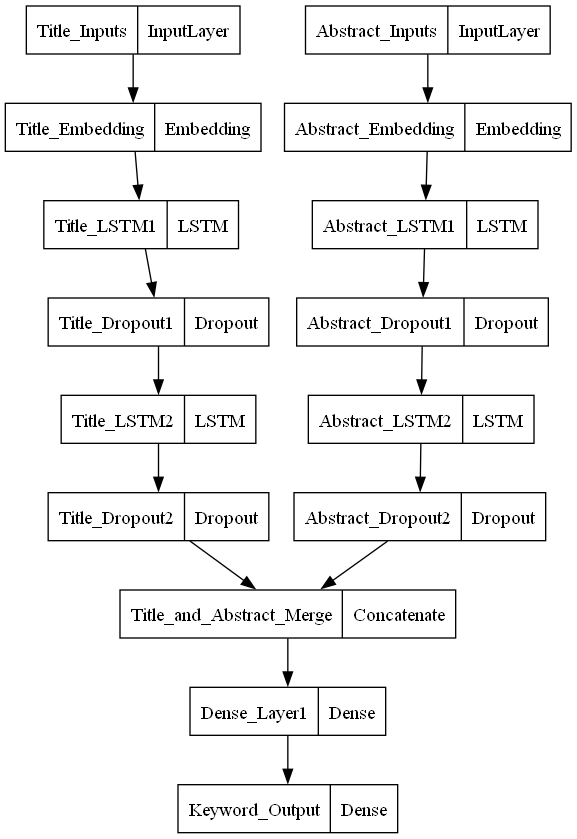

# ArXiv Keyword Predictor
## Overview
This is a Python repo that contructs a neural network which attempts to predict the keywords used in a manuscript from arXiv given the words from the title and abstract.

## How it Works
### The Data
The data comes from a kaggle dataset which can be found here https://www.kaggle.com/datasets/spsayakpaul/arxiv-paper-abstracts. The only columns contained in the dataset store the title, abstract, and keywords associated with the manuscipt.

## Data Cleaning/Tokenization
The data was tokenized using Keras Tokenizer. The titles and abstracts were tokenized such that only the top 50 most common words were used, a list of filler words were also removed such that simple words like 'a', 'the', 'where', were not included in tokenization.

### Neural Network
The neural network was built to take the tokenized titles and abstracts in different streams before joining them together and producing an output. Custom loss functions were used to ensure loss was properly weighted between different classes as the dataset is imbalanced. An image showing the layout of this network can be seen below.

## Performance
Below you can find the classification matrix output by the program on an 80-20 train test split.

|              | Precision | Recall | F1-Score |
| ------------ | --------- | ------ | -------- |
|  Micro Avg   |   0.80    |  0.73  |   0.76   |
|  Macro Avg   |   0.56    |  0.51  |   0.53   |
| Weighted Avg |   0.79    |  0.73  |   0.76   |
| Samples Avg  |   0.83    |  0.79  |   0.78   |
 
## Other Links
If you are interested in NLP these are some of the articles that helped me.

- https://www.kaggle.com/code/matthewmaddock/nlp-arxiv-dataset-transformers-and-umap
- https://www.analyticsvidhya.com/blog/2021/09/building-a-machine-learning-model-for-title-generation/
- https://thecleverprogrammer.com/2020/10/05/title-generator-with-machine-learning/
- https://towardsdatascience.com/generating-scientific-papers-titles-using-machine-learning-98c8c9bc637e
- https://keras.io/api/
